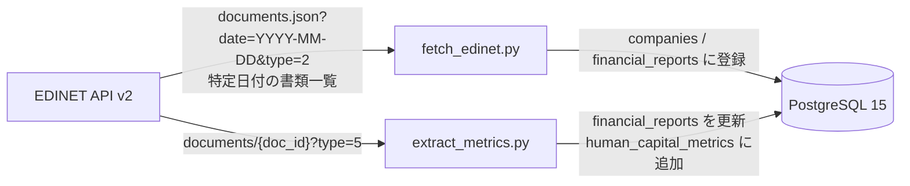

## はじめに

EDINET の有価証券報告書を分析に使おうとすると、最初に悩むのが XBRL です。

XBRL は財務報告のための XML ベースの標準フォーマットですが、値だけ見ても意味が確定しません。`contextRef` を見て期間や連結/個別を判断し、企業ごとの拡張要素も追う必要があります。試作段階では、この解釈コストがかなり重いです。

そこで今回は、EDINET API v2 の CSV ダウンロード機能を使って、財務データと人的資本データを PostgreSQL に入れる最小 ETL を作りました。

やっていることはシンプルです。

1. `documents.json?date=YYYY-MM-DD&type=2` で特定日付の書類一覧を取る
2. 標準の企業有価証券報告書だけを絞る
3. `type=5` で ZIP を取得する
4. CSV を読んで必要な項目を DB に入れる

## なぜ XBRL ではなく CSV から始めたか

EDINET API v2 では、`documents/{doc_id}?type=5` を叩くと、XBRL をフラット化した CSV 一式を ZIP で取得できます。

今回ほしかったのは、タグの完全理解よりも、まず分析可能なテーブルを作ることでした。CSV なら `項目名`、`値`、`相対年度` を見ながら探索できるので、入口がかなり軽くなります。

もちろん、CSV にしても課題は残ります。売上だけでも `売上高`、`営業収益`、`売上収益`、`完成工事高` のように複数候補を見る必要がありました。さらに人的資本は、後で触れるとおり `項目名` としては出てこず、テキストブロックに埋まっているケースがありました。つまり、XBRL の複雑さは避けられても、データのゆらぎは残ります。

## 構成

構成は Python + PostgreSQL + Docker Compose の最小セットです。



テーブルは 3 つに分けました。

- `companies`: 企業マスタ
- `financial_reports`: 書類単位の財務指標
- `human_capital_metrics`: 人的資本指標

:::message
人的資本系は欠損や表記ゆれが出やすいので、最初から財務データと分けておくと影響を切り分けやすくなります。
:::

## 実装のポイント

### 書類一覧を先に確定する

`src/fetch_edinet.py` では `documents.json` を `type=2` で取得し、`ordinanceCode=010` かつ `formCode=030000` の標準的な企業有価証券報告書だけを対象にしています。

前提として、この API は「特定の日付に対応する書類一覧」を取るものです。まず `date` を決め、その日付の一覧から対象書類を絞り込む流れになります。

このときの `date` パラメータは、単純な提出日ではなく書類一覧 API の「ファイル日付」です。`YYYY-MM-DD` 形式で指定し、土日祝日も指定できます。公式仕様では、指定できるのは当日以前かつ直近 10 年以内の日付です。

更新タイミングも少し癖があります。当日分は日本時間 8:30 過ぎから原則 1 分ごとに更新され、過去分は日本時間 24 時過ぎの日次更新で差し替えられます。日次バッチにするなら、この前提を持っておくと扱いやすいです。

もう少し具体的に言うと、ここでやっているのは次の 3 点です。

- 企業マスタ `companies` を登録する
- `financial_reports` に処理対象の `doc_id` を入れる
- `csvFlag=1` の書類だけが後続の抽出対象になるようフラグを持つ

最初は `docDescription` に `有価証券報告書` を含むものを広く入れていましたが、投資信託や訂正報告書まで混ざってしまい、財務指標が取れない書類を何度も処理することになりました。最終的には、標準の企業有報だけに絞るのが素直でした。

### ZIP は保存せず、そのまま読む

`src/extract_metrics.py` では、未処理の書類を DB から取り出し、`type=5` で ZIP を取得します。ローカルには保存せず、`BytesIO` でそのまま展開しています。

```python
with zipfile.ZipFile(io.BytesIO(response.content)) as z:
    csv_files = [
        f for f in z.namelist()
        if f.endswith(".csv") and ("jpcrp" in f.lower() or "jpaud" in f.lower())
    ]
    for csv_file in csv_files:
        with z.open(csv_file) as f:
            df = pd.read_csv(f, encoding="utf-16le", sep="\t")
```

ここで注意が必要だったのは、CSV が UTF-16LE のタブ区切りだったことです。`read_csv` に何も指定しないと素直に読めませんでした。

もう一つハマったのが、`type=5` で常に ZIP が返るわけではないことです。CSV 非対応の書類では HTTP ステータスは 200 でも、中身が ZIP ではなく JSON の `{"metadata": {"status": "404"}}` になっていました。そのため、レスポンスをそのまま `ZipFile` に渡すのではなく、先に ZIP かどうかを判定するようにしています。

### 財務は `項目名`、人的資本はテキストブロックを見る

財務データは `項目名`、`値`、`相対年度` を見て拾っています。

- 売上は `売上高`、`営業収益`、`売上収益`、`完成工事高` を候補にする
- 利益は `営業利益`、`当期純利益` などを見る
- `相対年度` は `当期` か `提出者` を含むものに寄せる

財務項目はこのやり方で比較的素直に取れます。一方で人的資本は、最初に想定していた `管理職に占める女性労働者の割合` や `男性労働者の育児休業取得率` が、そのまま `項目名` の行に並んでいませんでした。

実際には、次のような `...TextBlock` の `値` に文章と表がまとめて入っていました。

- `jpcrp030000-asr_*:DescriptionOfMetricsRelatedTo...TextBlock`
- `jpcrp030000-asr_*:StrategyHumanCapitalTextBlock`

たとえば `値` の中に、`管理職に占める女性労働者の割合、男性労働者の育児休業取得率及び労働者の男女の賃金の差異 ... 10.1 42.8 80.8 ...` のような形で並んでいるケースがあります。そこで今は、財務は `項目名` ベース、人的資本はテキストブロックから数値を切り出す、という二段構えにしています。

## やってみて分かったこと

財務項目は比較的安定して取れました。売上、営業利益、純利益、従業員数あたりは、多少の表記差があっても拾いやすいです。

一方で、人的資本指標は想像以上に取り扱いが難しいです。問題は表記ゆれだけではなく、「値がどこにあるか」も揺れることでした。`項目名` に独立した行として出ると思っていたら、実際にはサステナビリティ関連のテキストブロックに埋め込まれていました。

この発見は、実装の方針にかなり影響しました。人的資本は単純な行抽出ではなく、文章や表を含むテキストの解釈が必要です。ここは「取れるか」より、「どこまで再現性高く取れるか」を設計する問題だと感じました。

## いまの課題

- `human_capital_metrics` に一意制約がなく、再実行時の重複投入を防ぎ切れていない
- `fiscal_year` を固定値で入れている箇所があり、書類メタデータから導出したい
- 人的資本の抽出はテキストブロックに対するヒューリスティックなので、会社ごとの表現差にまだ弱い
- 項目マッピングがコードに直書きなので、設定ファイル化したい
- 件数や欠損率を見るテストがまだない

## まとめ

EDINET API v2 の CSV ダウンロードは、「まず有価証券報告書を分析できる形にする」ための入口としてかなり使いやすいです。XBRL を最初から読み切るより、まず CSV で最小 ETL を作って、どの項目が素直に取れ、どこから先が泥臭くなるのかを確認するほうが進めやすいと感じました。

今回の実装でも、財務データは安定して入り、人的資本も一部は取れるところまで来ました。ただ、人的資本はまだテキストブロック解釈に依存しているので、継続的に回すなら抽出ルールの整理と検証が必要です。EDINET を触り始めたばかりで、まずは分析用テーブルを作りたい人には、この順番がちょうどよさそうです。

## 参考リンク

- [EDINET API仕様書（Version 2）](https://disclosure2dl.edinet-fsa.go.jp/guide/static/disclosure/download/ESE140206.pdf)
- [EDINET API関連資料一覧](https://disclosure2dl.edinet-fsa.go.jp/guide/static/disclosure/WZEK0110.html)
- [EDINET APIキー発行ページ](https://api.edinet-fsa.go.jp/api/auth/index.aspx?mode=1)
