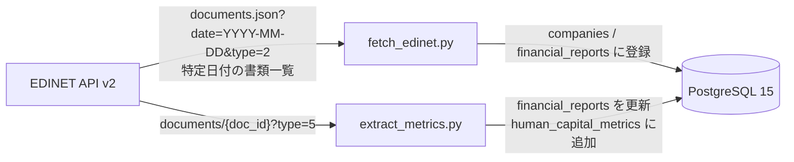

## はじめに

EDINET は、金融庁が運営している開示書類の電子開示システムです。上場企業などが提出する有価証券報告書、半期報告書、臨時報告書などがここに集まります。EDINET API を使うと、ある日に提出された書類の一覧を取ったり、個別の書類ファイルをダウンロードしたりできます。この記事では、その中でも有価証券報告書を対象に、EDINET API v2 の CSV から PostgreSQL へ入れる最小 ETL を作った話を書きます。

最初に用語だけそろえておきます。

- `EDINET`: 金融庁の開示書類システム
- `有価証券報告書`: 企業の年次の詳しい開示書類。財務情報や事業内容、人材情報などが載る
- `XBRL`: 開示データを機械可読にするための構造化フォーマット
- `CSV ZIP`: EDINET が XBRL を表形式に変換して ZIP で返してくれるファイル群

EDINET の有価証券報告書を分析に使おうとすると、最初に悩むのが XBRL です。XBRL 自体は機械処理向きなのですが、初見だと「どの数字が、どの期間の、どの範囲の値なのか」を読むための前提知識が必要です。試作段階では、この解釈コストがかなり重く感じました。

そこで今回は、EDINET API v2 の CSV ダウンロード機能を使って、財務データと人的資本データを PostgreSQL に入れる最小 ETL を作りました。やっていることはシンプルです。

1. 書類一覧 API の endpoint である `documents.json?date=YYYY-MM-DD&type=2` を呼んで、特定日付の書類一覧を取る
2. このリポジトリで対象にしている通常の国内企業の有価証券報告書だけを絞る
3. 個別書類取得 API の endpoint である `documents/{doc_id}?type=5` を呼んで、CSV ZIP を取得する
4. CSV を読んで必要な項目を DB に入れる

実装全体は次の GitHub リポジトリにあります。

@[card](https://github.com/hiroshi0918/edinet_data_pipeline)

## 「値だけ見ても意味が確定しない」とは何か

まずは、EDINET の CSV でよく見る列を読みやすくした代表例を見ます。

| 項目名 | 値 | 相対年度 | どう読むか |
| --- | ---: | --- | --- |
| 売上高 | 1,234,567 | 当期 | 今回の年度の売上高 |
| 売上高 | 1,180,000 | 前期 | 1つ前の年度の売上高 |
| 従業員数 | 250 | 提出者 | 提出会社そのものの従業員数 |

ここで重要なのは、`1,234,567` や `250` という数字だけ見せられても意味は決まらないことです。`項目名` を見ないと売上なのか従業員数なのか分かりませんし、`相対年度` を見ないと当期なのか前期なのかも分かりません。

XBRL では、この「周辺情報」をさらに `contextRef` で表します。たとえば、同じ売上でも次のように見えます。

```xml
<NetSales contextRef="CurrentYearDuration_ConsolidatedMember">1234567</NetSales>
<NetSales contextRef="Prior1YearDuration_ConsolidatedMember">1180000</NetSales>
```

`NetSales` というタグ名が同じでも、`contextRef` が違うので「当期か前期か」「連結か個別か」が変わります。つまり XBRL は、数字の横にある文脈まで読まないと正しく解釈しづらい形式です。

## 今回使う API を先に整理する

ここは少し紛らわしいところです。

この記事では、次の 2 本の API を使います。

- `documents.json`: 書類一覧 API の endpoint 名。URL の一部で、コマンド名でも取得対象ファイル名でもない
- `documents/{doc_id}`: 個別書類取得 API の endpoint 名。`{doc_id}` の部分に書類IDを入れる

どちらにも `type` というパラメータがありますが、同じ意味ではありません。

- `documents.json` での `type=2` は「書類一覧を返してほしい」
- `documents/{doc_id}` での `type=5` は「CSV ZIP を返してほしい」

たとえば実際に呼ぶ URL は次のような形です。

```text
https://api.edinet-fsa.go.jp/api/v2/documents.json?date=2024-03-29&type=2
https://api.edinet-fsa.go.jp/api/v2/documents/S100XXXX?type=5
```

つまり `type` は「EDINET API 全体で共通の番号」ではなく、「その API で何を返してほしいかを指定するオプション」です。なので、同じ `type=2` でも API が変われば意味も変わります。

### `documents.json` の `type`

| リクエスト | 意味 |
| --- | --- |
| `type=1` | メタデータのみ |
| `type=2` | 提出書類一覧 + メタデータ |

### `documents/{doc_id}` の `type`

| リクエスト | 意味 |
| --- | --- |
| `type=1` | 提出本文書 + 監査報告書の ZIP |
| `type=2` | PDF |
| `type=3` | 添付文書の ZIP |
| `type=4` | 英文ファイルの ZIP |
| `type=5` | CSV ZIP |

この記事で使うのは、書類一覧 API の `type=2` と、個別書類取得 API の `type=5` です。

## なぜ XBRL ではなく CSV から始めたか

EDINET API v2 では、`documents/{doc_id}?type=5` を叩くと、XBRL の要素を表形式の行に並べた TSV/CSV ファイル群を ZIP で取得できます。

ZIP の中身はイメージとしては次のような感じです。

```text
ZIP
└── XBRL_TO_CSV/
    ├── jpcrp_....csv
    └── jpaud_....csv
```

中の 1 行は、たとえば次のように読めます。

| 項目名 | 値 | 相対年度 |
| --- | ---: | --- |
| 売上高 | 1,234,567 | 当期 |

つまり「XBRL を全部理解する」代わりに、「表形式に展開された行を読む」ことから始められます。今回ほしかったのはタグの完全理解よりも、まず分析可能なテーブルを作ることでした。CSV なら `項目名`、`値`、`相対年度` を見ながら探索できるので、入口がかなり軽くなります。

もちろん、CSV にしても課題は残ります。売上だけでも `売上高`、`営業収益`、`売上収益`、`完成工事高` のように複数候補を見る必要がありました。さらに人的資本は、後で触れるとおり `項目名` としては出てこず、テキストブロックに埋まっているケースがありました。つまり、XBRL の複雑さは少し和らいでも、データのゆらぎは残ります。

## 構成

構成は Python + PostgreSQL + Docker Compose の最小セットです。




https://github.com/hiroshi0918/edinet_data_pipeline/blob/main/src/fetch_edinet.py

https://github.com/hiroshi0918/edinet_data_pipeline/blob/main/src/extract_metrics.py

主要テーブルは 3 つで、加えて抽出根拠を残す補助テーブルを 1 つ使っています。

- `companies`: 企業マスタ
- `financial_reports`: 書類単位の財務指標と処理状態
- `human_capital_metrics`: 会社コード・年度ごとの人的資本指標
- `metric_evidence`: どの CSV のどの行から値を拾ったかを残す監査用テーブル

## 実装のポイント

### 書類一覧を先に確定する

`src/fetch_edinet.py` から辿れる `fetch` 処理では `documents.json` を `type=2` で取得し、次の条件を満たすものだけを対象にしています。

- `ordinanceCode=010`
- `formCode=030000`
- `docDescription` が `有価証券報告書－` で始まる

ここで言いたい「通常の国内企業の有価証券報告書」は、この条件で絞った書類のことです。`formCode=030000` だけだと別の `ordinanceCode` の書類まで混ざるので、`ordinanceCode=010` も合わせて見ています。さらに `docDescription` も見て、最初の ETL 対象を通常の有報に寄せ、訂正報告書、四半期/半期、投資信託系などを混ぜないようにしています。

前提として、この API は「特定の日付に対応する書類一覧」を取るものです。まず `date` を決め、その日付の一覧から対象書類を絞り込む流れになります。

このときの `date` パラメータは、単純な提出日ではなく書類一覧 API の「ファイル日付」です。`YYYY-MM-DD` 形式で指定し、土日祝日も指定できます。公式仕様では、指定できるのは当日以前かつ直近 10 年以内の日付です。

更新タイミングも少し癖があります。当日分は日本時間 8:30 過ぎから原則 1 分ごとに更新され、過去分は日本時間 24 時過ぎの日次更新で差し替えられます。日次バッチにするなら、この前提を持っておくと扱いやすいです。

もう少し具体的に言うと、ここでやっているのは次の 4 点です。

- 企業マスタ `companies` を登録する
- `financial_reports` に処理対象の `doc_id` を入れる
- `csvFlag=1` の書類は `pending`、CSV 非対応は `skipped` にする
- `fiscal_year` はまず `periodEnd` から、なければ `submitDateTime` から導出する

最初は `docDescription` に `有価証券報告書` を含むものを広く入れていましたが、対象外の書類まで混ざりやすく、財務指標が取れない書類を何度も処理することになりました。最終的には、対象を狭く定義してから取るほうが素直でした。

### ZIP は保存せず、そのまま読む

`src/extract_metrics.py` から辿れる `process` 処理では、未処理の書類を DB から取り出し、`documents/{doc_id}?type=5` で CSV ZIP を取得します。ローカルには保存せず、`BytesIO` でそのまま展開しています。

```python
with zipfile.ZipFile(io.BytesIO(zip_bytes)) as archive:
    csv_files = [
        name
        for name in archive.namelist()
        if name.endswith(".csv")
        and ("jpcrp" in name.lower() or "jpaud" in name.lower() or "xbrl_to_csv" in name.lower())
    ]
    for csv_file in csv_files:
        with archive.open(csv_file) as handle:
            frame = pd.read_csv(handle, encoding="utf-16le", sep="\t")
```

ここで注意が必要だったのは、CSV が UTF-16LE のタブ区切りだったことです。見た目は CSV ですが、実際には TSV として読むほうが近いです。`read_csv` に何も指定しないと素直に読めませんでした。

もう一つハマったのが、`type=5` で常に ZIP が返るわけではないことです。CSV 非対応の書類では HTTP ステータスは 200 でも、中身が ZIP ではなく JSON の `{"metadata": {"status": "404"}}` になっていました。そのため、レスポンスをそのまま `ZipFile` に渡すのではなく、先に ZIP かどうかを判定するようにしています。`csvFlag=1` はかなり参考になりますが、それでも最後はレスポンスの実体を確認したほうが安全でした。

### 財務は `項目名`、人的資本はテキストブロックを見る

財務データは `項目名`、`値`、`相対年度` を見て拾っています。

- 売上は `売上高`、`営業収益`、`売上収益`、`完成工事高` を候補にする
- 利益は `営業利益`、`営業損失`、`当期純利益` などを見る
- `相対年度` は `当期`、`当年`、`当連結会計年度`、`提出者` を含むものに寄せる

財務項目はこのやり方で比較的素直に取れます。一方で人的資本は、最初に想定していた `管理職に占める女性労働者の割合` や `男性労働者の育児休業取得率` が、そのまま `項目名` の行に並んでいませんでした。

実際には、次のような `...TextBlock` の `値` に文章と表がまとめて入っていました。

- `jpcrp030000-asr_*:DescriptionOfMetricsRelatedTo...TextBlock`
- `jpcrp030000-asr_*:StrategyHumanCapitalTextBlock`

たとえば `値` の中に、`管理職に占める女性労働者の割合 10.1 男性労働者の育児休業取得率 42.8 労働者の男女の賃金の差異(%) 80.8` のように並んでいるケースがあります。そこで今は、財務は `項目名` ベース、人的資本はテキストブロックから数値を切り出す、という二段構えにしています。

### `human_capital_metrics` と再実行時の重複をどう扱っているか

`human_capital_metrics` は、会社コードと年度ごとの人的資本指標を置く表です。たとえば「ある会社の 2024 年度の女性管理職比率」「同じ会社の 2024 年度の男女賃金差異」のような値をここに入れます。

以前は、同じ会社・同じ年度のデータを再実行のたびに積み増してしまうのが課題でした。今は `1 会社 × 1 年度 × 1 ソース` で 1 行になるようにしています。

ここでいう「一意制約」は、同じキーの行を二重に入れないための DB のルールです。`human_capital_metrics` では `(edinet_code, fiscal_year, source_name)` を一意にし、同じ組み合わせがすでにあれば PostgreSQL の `ON CONFLICT DO UPDATE` で追加ではなく更新に回しています。これで、同じ処理をもう一度流しても重複しにくくなりました。

あわせて `metric_evidence` に、どの CSV のどの項目名・どの値から拾ったかを残しています。人的資本の抽出はどうしても泥臭くなるので、後から「この値はどこから来たか」を確認できるようにしておくとかなり助かります。

## やってみて分かったこと

財務項目は比較的安定して取れました。売上、営業利益、純利益、従業員数あたりは、多少の表記差があっても拾いやすいです。

一方で、人的資本指標は想像以上に取り扱いが難しいです。問題は表記ゆれだけではなく、「値がどこにあるか」も揺れることでした。`項目名` に独立した行として出ると思っていたら、実際にはサステナビリティ関連のテキストブロックに埋め込まれていました。

この発見は、実装の方針にかなり影響しました。人的資本は単純な行抽出ではなく、文章や表を含むテキストの解釈が必要です。ここは「取れるか」より、「どこまで再現性高く取れるか」を設計する問題だと感じました。

## いまの課題

- 人的資本の抽出はテキストブロックに対するヒューリスティックなので、会社ごとの表現差にまだ弱い
- 項目マッピングがコードに直書きなので、設定ファイル化したい
- 件数や欠損率を見るテストがまだない

## まとめ

EDINET API v2 の CSV ダウンロードは、「まず有価証券報告書を分析できる形にする」ための入口としてかなり使いやすいです。XBRL を最初から読み切るより、まず CSV で最小 ETL を作って、どの項目が素直に取れ、どこから先が泥臭くなるのかを確認するほうが進めやすいと感じました。

今回の実装でも、財務データは安定して入り、人的資本も一部は取れるところまで来ました。再実行時の重複防止や `fiscal_year` の導出も、今の実装ではある程度整理できています。ただ、人的資本はまだテキストブロック解釈に依存しているので、継続的に回すなら抽出ルールの整理と検証が必要です。EDINET を触り始めたばかりで、まずは分析用テーブルを作りたい人には、この順番がちょうどよさそうです。

## 参考リンク

@[card](https://github.com/hiroshi0918/edinet_data_pipeline)

- [EDINET API仕様書（Version 2）](https://disclosure2dl.edinet-fsa.go.jp/guide/static/disclosure/download/ESE140206.pdf)
- [Appendix 1 Form Code List](https://disclosure2dl.edinet-fsa.go.jp/guide/static/disclosure/download/ESE140327.xlsx)
